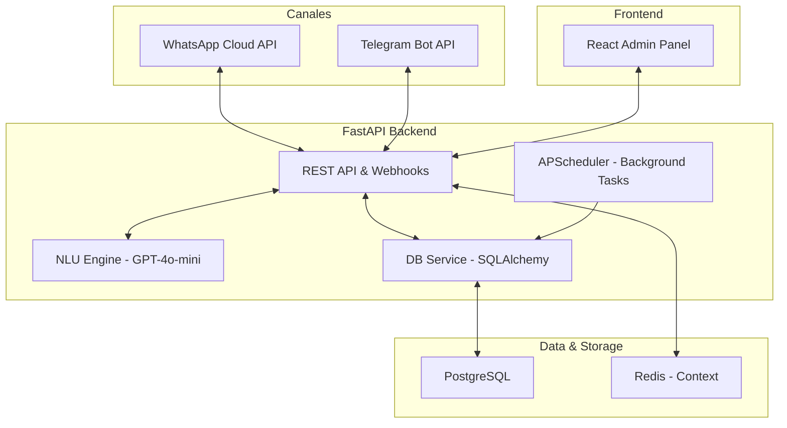

# 📊 SmartBooking AI - Estado del Proyecto (Versión Simplificada)

## 🎯 Resumen Ejecutivo

**Proyecto:** SmartBooking AI - Sistema de agendamiento inteligente multi-canal (WhatsApp/Telegram).
**Cliente:** Barbería/Salones de belleza en República Dominicana.
**Tecnología Principal:** FastAPI + GPT-4o-mini + React + PostgreSQL + APScheduler.
**Estado Actual:** **98% MVP Completado** 🚀

---

## 📈 Progreso General y Sprints

### ✅ Sprint 1-4: Consolidated Backend (100%)
**Estado:** ✅ Producción Ready
**Descripción:** Se migró la lógica de Django y el Agent Service previo a un esquema unificado de FastAPI para mayor rendimiento y simplicidad.

#### Logros:
- ✅ **API REST Completa:** Endpoints para Owners, Businesses, Services, Customers y Appointments.
- ✅ **Agente Conversacional:** Integración con WhatsApp Cloud API y Telegram Bot API.
- ✅ **Motor NLU:** Procesamiento con GPT-4o-mini para detección de intenciones y extracción de entidades.
- ✅ **Gestión de Contexto:** Redis para persistencia de conversaciones (TTL 1h).
- ✅ **Automatización:** APScheduler integrado para recordatorios (24h/2h), lista de espera (FIFO) y reportes diarios.
- ✅ **Seguridad:** JWT Auth con auto-refresh, validación de firmas Meta y Rate Limiting.

#### Archivos Clave:
```
backend/api-backend/
29: ├── main.py (Entry point + Webhooks + Middlewares)
30: ├── app/
31: │   ├── api/ (Endpoints REST por módulo)
32: │   ├── models.py (SQLAlchemy Models)
33: │   ├── services/ (DB, WhatsApp, Telegram, NLU, Conversation)
34: │   ├── handlers/ (Booking, Cancel, Check, Modify flows)
35: │   └── core/ (Scheduler, Security, Config)
36: └── alembic/ (Database Migrations)
37: ```

---

### ✅ Sprint 5: Frontend Admin Panel (100%)
**Estado:** ✅ Completado & Polished 🚀
**Descripción:** Panel administrativo moderno construido con React 19 y TypeScript. Completamente optimizado para móviles y con feedback visual avanzado.

#### ✅ Logros:
- ✅ **Dashboard:** Métricas en tiempo real e ingresos proyectados con Skeleton Loaders.
- ✅ **Calendario:** Vista interactiva optimizada para web y móvil.
- ✅ **Gestión de Citas:** Tabla y vistas de tarjeta con modales de confirmación personalizados.
- ✅ **Gestión de Clientes:** CRUD completo con feedback visual (Toasts).
- ✅ **Gestión de Servicios:** Configuración completa y control de estados activos.
- ✅ **Configuración de Horarios:** Editor de disponibilidad semanal robusto.
- ✅ **Robustez:** Error Boundaries globales y manejo de fallos de API resiliente.
- ✅ **UX/UI:** TailwindCSS v4 + Responsive Design extremo + Accesibilidad ARIA.

---

## 🏗️ Arquitectura Simplificada



---

## 🚀 Capacidades Clave

### 🤖 IA y Conversación
- **Flujos Naturales:** El bot entiende "mañana en la tarde", "una cita para recorte" y reagendamientos complejos.
- **Multi-canal:** Misma lógica para WhatsApp y Telegram.
- **Recordatorios Inteligentes:** Envío automático de confirmaciones con botones interactivos.

### 📅 Gestión y Automatización
- **Lista de Espera:** Cuando se cancela una cita, el sistema ofrece automáticamente el espacio al siguiente en la fila.
- **Agenda Diaria:** El dueño recibe un PDF/Resumen por WhatsApp a las 8:00 AM con su agenda del día.
- **Sincronización:** El calendario web se actualiza instantáneamente con las reservas del bot.

---

## 📦 Infraestructura y Deployment
- **Contenedores:** Dockerizados backend y frontend.
- **Proxy:** Nginx configurado para routing y SSL.
- **Monitoreo:** Sentry integrado para tracking de errores en tiempo real.
- **Rate Limit:** Protección contra ataques de fuerza bruta en webhooks y API.

---

## 🎯 Próximos Pasos
1. **Testing Final:** Cobertura de tests unitarios en el backend (SQLAlchemy/FastAPI).
2. **Deployment:** Configuración final de CI/CD para despliegue en VPS/Cloud.
3. **Optimización:** Minificar el uso de tokens de GPT mediante caché de respuestas comunes.

---

**🎉 Proyecto en fase de ajuste final - 98% completado**
**Última actualización:** 7 de abril, 2026 (Frontend Admin Panel Polished)
