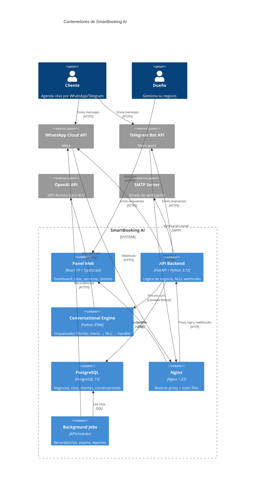

# 📅 SmartBooking AI

[](https://www.python.org/)
[](https://fastapi.tiangolo.com/)
[](https://react.dev/)
[](https://www.typescriptlang.org/)
[](https://www.postgresql.org/)
[](LICENSE)

**Sistema de agendamiento inteligente para negocios de citas** (barberías, salones de belleza, clínicas), con panel web administrativo y canales conversacionales por WhatsApp y Telegram.

> **Propuesta de valor:** Tus clientes agendan, cancelan y consultan citas escribiendo en WhatsApp o Telegram como si hablaran con un recepcionista. Sin apps que instalar. Sin fricción.

---

## ✨ Features

### 💬 Canales Conversacionales (WhatsApp + Telegram)
- ✅ NLU híbrida con menú guiado determinístico + fallback con GPT-4o-mini
- ✅ Comprensión de lenguaje natural en español (fechas, horas, servicios)
- ✅ Flujos completos: agendar, cancelar, modificar, consultar citas
- ✅ Máquina de estados finita (FSM) con 3 intentos máximos por estado, luego reset a menú

### 📊 Panel Web Administrativo
- ✅ Dashboard con KPIs del negocio y métricas de ingresos
- ✅ CRUD completo de servicios, clientes y citas
- ✅ Calendario visual interactivo con skeleton loaders
- ✅ Configuración de horarios semanales, excepciones y time blocks
- ✅ Gestión multi-negocio por owner
- ✅ Error Boundary global + Toast notifications

### 🤖 IA Conversacional
- ✅ Hybrid Orchestrator: menú guiado → NLU → handler determinístico
- ✅ 6 handlers de intención: Book, Cancel, Check, Modify, BusinessInfo, Calendar
- ✅ Parseo de fechas y horas en español con flow_interpreter
- ✅ Sistema de buffer entre servicios consecutivos

### 🔐 Seguridad
- ✅ JWT con refresh token rotation y bcrypt
- ✅ Verificación de email con token de 48h
- ✅ Rate limiting sliding-window por IP (60 req/60s)
- ✅ Idempotencia de eventos de canales (deduplicación por event_id)
- ✅ Estados de conversación persistidos en PostgreSQL

---

## 🏗️ Arquitectura



**Estilo:** Modular Monolith con principios Clean Architecture y Conversational Engine con FSM híbrida. Documentado en la [constitución del proyecto](.specify/memory/constitution.md).

---

## 🛠️ Tech Stack

| Capa | Tecnología | Versión |
|------|-----------|---------|
| **Backend** | FastAPI + Python | 3.12+ |
| **ORM** | SQLAlchemy Async + Alembic | 2.0 |
| **Base de datos** | PostgreSQL | 15 |
| **Frontend** | React + TypeScript + Vite | 19 / 5.7 / 7 |
| **Estado/Fetching** | Zustand + @tanstack/react-query | 5 |
| **Estilos** | TailwindCSS | — |
| **IA / NLU** | OpenAI GPT-4o-mini | — |
| **WhatsApp** | Meta Cloud API | — |
| **Telegram** | Telegram Bot API | — |
| **Testing** | pytest + Playwright | — |
| **Infra local** | Docker Compose + Nginx + ngrok | — |

---

## 🚀 Quick Start

### Prerrequisitos
- Docker y Docker Compose
- Node.js 20+

### Desarrollo local

```bash
# 1. Clonar
git clone <repo-url>
cd appoinment-ai

# 2. Configurar
cp .env.example .env
# Editar: DATABASE_URL, META_WABA_TOKEN, TELEGRAM_BOT_TOKEN, OPENAI_API_KEY

# 3. Levantar stack completo
docker compose up --build

# 4. Opcional: exponer webhooks para desarrollo
./scripts/dev-ngrok-telegram.sh
```

Accesos:
- **App vía Nginx:** `http://localhost:8080`
- **Backend FastAPI:** `http://localhost:8000`
- **API Docs (Swagger):** `http://localhost:8000/docs`
- **PostgreSQL local:** `localhost:5435`

Para desarrollo detallado, ver `specs/000-project-baseline/quickstart.md`.

---

## 📁 Estructura del Proyecto

```
appoinment-ai/
├── backend/api-backend/
│   └── app/
│       ├── api/            # Routers (8): auth, businesses, services, appointments...
│       ├── core/           # FSM, Orchestrator, Security, DB, Scheduler, Rate Limiter
│       ├── handlers/       # 6 handlers de intención conversacional
│       ├── services/       # NLU Engine, WhatsApp, Telegram, Email, DB Service
│       ├── prompts/        # System prompts para GPT-4o-mini
│       ├── schemas/        # Pydantic schemas
│       ├── utils/          # Date parsing, time parsing, channel utilities
│       └── models.py       # 14 modelos SQLAlchemy
├── frontend/
│   └── src/
│       ├── pages/          # 13 páginas (Dashboard, Calendar, Appointments...)
│       ├── components/     # UI library + layouts + error boundary
│       ├── store/          # Zustand: auth + business
│       └── services/       # Axios client con interceptors y refresh token
├── specs/                  # 7 fases de especificación (spec-driven development)
│   ├── 000-project-baseline/
│   ├── 001-guided-menu-bot/
│   └── ...
├── docs/
│   ├── ARCHITECTURE.md
│   └── archive/            # Documentos históricos
├── docker-compose.yml
└── nginx_new_default.conf
```

---

## 📊 API Endpoints Principales

| Método | Ruta | Descripción | Auth |
|--------|------|-------------|------|
| POST | `/api/auth/login` | Login owner | Público |
| POST | `/api/auth/register` | Registrar owner | Público |
| POST | `/api/auth/refresh` | Refrescar token | Refresh |
| GET | `/api/dashboard` | KPIs del negocio | JWT |
| GET | `/api/businesses/{id}/appointments` | Listar citas | JWT |
| POST | `/api/businesses/{id}/appointments` | Crear cita (manual) | JWT |
| GET | `/api/businesses/{id}/services` | Servicios del negocio | JWT |
| GET | `/api/businesses/{id}/customers` | Clientes del negocio | JWT |
| GET | `/api/schedule-rules` | Reglas de horario | JWT |
| POST | `/webhooks/whatsapp` | Webhook WhatsApp | Signature |
| POST | `/webhooks/telegram` | Webhook Telegram | Token |

---

## 🧪 Testing

| Tipo | Framework | Comando |
|------|-----------|---------|
| Backend unit | pytest | `cd backend/api-backend && pytest tests/ -v` |
| Frontend E2E | Playwright | `cd frontend && npm run test:e2e` |

25+ tests backend cubriendo: **FSM**, **orquestador**, **handlers** (booking, cancel, modify), **NLU**, **seguridad** (tokens, webhooks, refresh), **rate limiting**, e **idempotencia**.

---

## 🔐 Seguridad

- **JWT** con refresh token opaco (SHA-256 hashed) y rotación en cada uso
- **Revocación** de tokens en logout, verificación de email y cambio de contraseña
- **Rate limiting** sliding-window en memoria (60 req/60s por IP)
- **Idempotencia** de eventos de canales — evita citas duplicadas por retries
- **Verificación de email** con token de 48 horas
- **Webhook signatures** para WhatsApp (Meta) y Telegram

---

## 📄 Licencia

MIT © [Tu nombre] 2026
