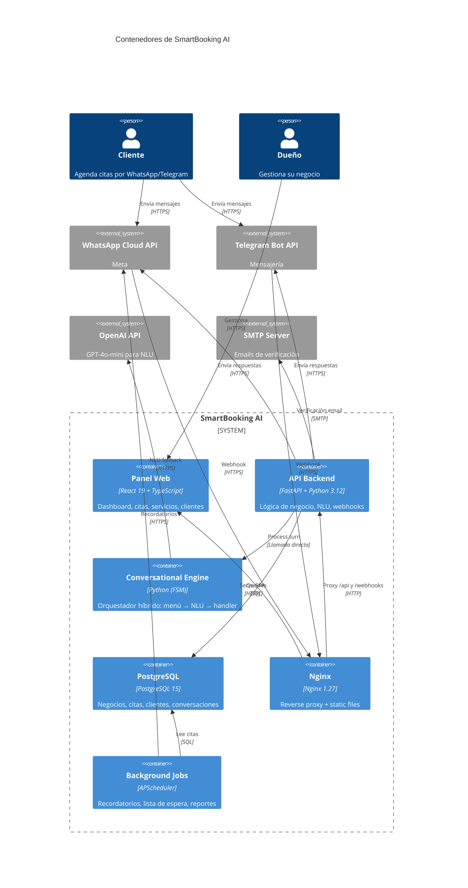
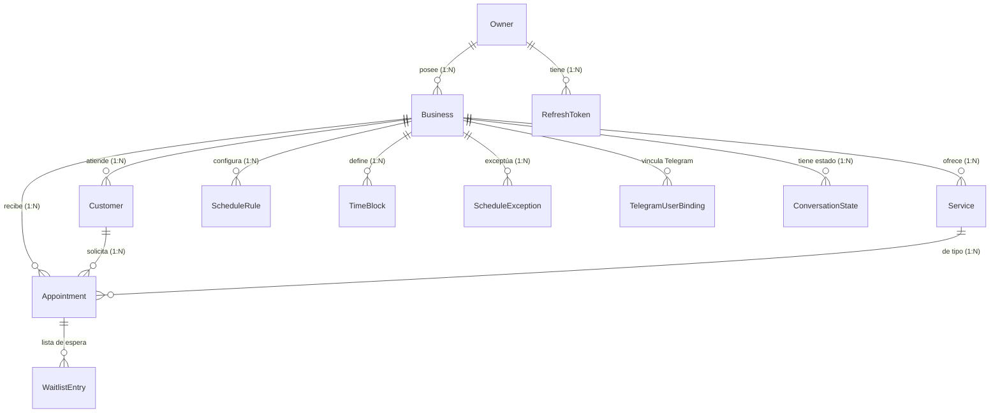

# 🏗️ Architecture: SmartBooking AI

## Diagrama C4 — Nivel Contenedores



---

## Estilo Arquitectónico

**Modular Monolith con principios Clean Architecture y Hybrid Orchestrator conversacional.**

```
api/          ← Routers FastAPI — HTTP concerns only
core/         ← FSM, Orchestrator, Security, Scheduler — infraestructura
handlers/     ← 6 handlers de intención — un handler por flujo de negocio
services/     ← NLU Engine, WhatsApp, Telegram, Email, DB Service — integraciones externas
prompts/      ← System prompts para GPT-4o-mini
utils/        ← Date parsing, time parsing, channel utilities
models.py     ← Entidades de dominio — 14 modelos SQLAlchemy
```

**Principio clave:** El `Orchestrator` es el corazón del sistema conversacional. Recibe un mensaje de cualquier canal y lo procesa a través de una pipeline: menú guiado → NLU fallback → handler determinístico. Ver [ADR-002](adr/ADR-002-hybrid-orchestrator-over-nlu-pure.md).

---

## Flujo de Datos Principal: Agendamiento de Cita

```
Cliente → [WhatsApp: "Quiero agendar para el lunes a las 3"]
  → Meta Cloud API → POST /webhooks/whatsapp (Nginx)
    → Signature verification (Meta signatures)
    → Idempotency check (ProcessedChannelEvent)
    → Orchestrator.process_message()
      → Step 1: Guided Menu Router
        → ¿Está en un menú activo? Sí → ejecuta acción determinística
        → No → escala a NLU
      → Step 2: NLU Engine (GPT-4o-mini)
        → System prompt: interpreta texto en español
        → Classify intent: BOOK_APPOINTMENT (confianza: 0.92)
        → Extract entities: date="lunes", time="3pm", service="corte"
        → Confidence check → ≥ threshold → continúa
      → Step 3: FSM validation
        → Current state: IDLE → valid transition to: BOOKING_SELECT_DATE
        → ConversationState se actualiza en PostgreSQL
      → Step 4: BookingHandler.process()
        → date_parse: "lunes" → 2026-06-30
        → time_parse: "3" → 15:00
        → db_service.get_availability(business_id, date)
        → ¿Múltiples slots? "Tenemos 3:00pm y 3:30pm disponibles" → menú
        → ¿Un slot? Confirmar: "¿Confirmo la cita para el lunes 30 a las 3:00pm?"
        → Usuario confirma → db_service.create_appointment()
          → Re-validar disponibilidad antes de crear (race condition)
          → Crear Appointment con estado P (Pending)
          → Persistir evento en ProcessedChannelEvent (idempotencia)
      → Step 5: Response Builder
        → "✅ Cita agendada: lunes 30 de junio, 3:00pm - Corte de cabello"
        → WhatsApp Client → send_message()
      → Step 6: Background (opcional)
        → Scheduler agenda recordatorio 24h antes
  → Cliente recibe confirmación en WhatsApp
```

---

## Patrones de Diseño

| Patrón | Ubicación | Propósito |
|--------|-----------|-----------|
| **State Machine** | `core/conversation_states.py`, `state_machine.py` | FSM con transiciones validadas |
| **Orchestrator** | `core/orchestrator.py` | Pipeline central de procesamiento de mensajes |
| **Chain of Responsibility** | `core/orchestrator.py` | Menú → NLU → Handler (routing secuencial) |
| **Strategy** | `handlers/` (6 handlers) | Un handler por intención conversacional |
| **Singleton** | `services/__init__.py` | Servicios instanciados una vez a nivel módulo |
| **Repository (implícito)** | `services/db_service.py` | Encapsula acceso a datos |
| **Observer** | `core/scheduler.py` | APScheduler para recordatorios y tareas programadas |
| **Idempotency** | `services/idempotency.py` | Deduplicación de eventos entrantes |

---

## Modelo de Datos Simplificado



---

## Decisiones Clave

| Decisión | ADR | Resumen |
|----------|-----|---------|
| Framework backend | [ADR-001](adr/ADR-001-fastapi-async-framework.md) | FastAPI como framework — async nativo, OpenAPI auto |
| Arquitectura NLU | [ADR-002](adr/ADR-002-hybrid-orchestrator-over-nlu-pure.md) | Híbrido: menú guiado + NLU fallback |
| Base de datos | [ADR-003](adr/ADR-003-postgresql-over-mongodb.md) | PostgreSQL sobre MongoDB — integridad referencial |

---

## Convención de UI conversacional

El canal Telegram usa **Inline Keyboards con `callback_data`** en lugar de menús
numerados en texto. La convención de ids, el patrón de footer de navegación y el
mapeo a WhatsApp Business API (Reply Buttons / List Message) están documentados en
[TELEGRAM_UI_CONVENTION.md](TELEGRAM_UI_CONVENTION.md).
